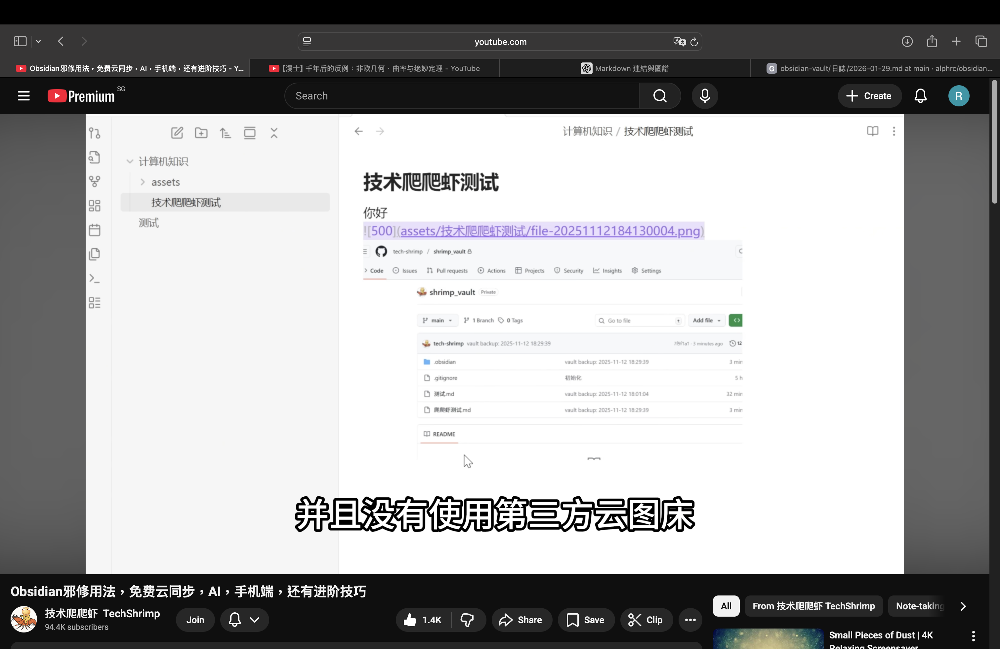

### 行動事項 (必須在 72 小時內啟動)
- 寫下技能
- [Attention](../學習/AI/Attention.md)
- [[../學習/AI/Attention]]

### 閱讀材料
- [《财务自由之路》：七年内赚到你的第一个1000w？](http://xhslink.com/o/A7MOvT2d4IM)

### 需要思考的內容
- 現金流
	- 我的技能
	- 找出可以產品化的方向：
		- 能否脫離時間產出？
		- 能否解決別人的問題？
		- 現在能否做出來？
	- 在 72 小時內做出最小版本

### 想法
- 每星期至少打一次給家人

反思

$$
\sum_{a}^{b} \min_{a} =
$$

